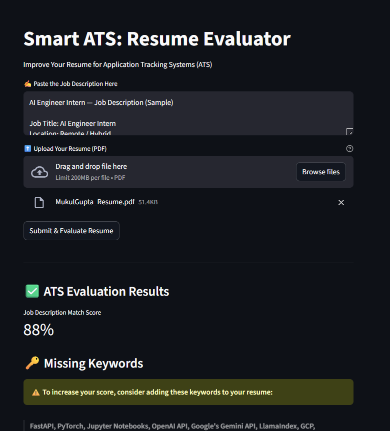

# 📝 Smart ATS — AI-Powered Resume Evaluator

A Streamlit application that uses **Google Gemini (gemini-2.5-flash)** to evaluate resumes against job descriptions.  
The app acts as an intelligent **ATS (Applicant Tracking System)**, analyzing resumes for keyword match, missing skills, and profile improvements based on the job description.

---

---

## 🚀 Features

- Upload resumes in **PDF format**
- Paste any job description for evaluation
- AI analyzes:
  - JD match percentage  
  - Missing keywords  
  - Profile summary & improvement suggestions  
- Uses **Gemini Flash** for fast and accurate text understanding
- Clean and interactive **Streamlit UI**
- Displays results in a structured and user-friendly format

---

## 🧠 How the App Works

- Extracts text from the uploaded PDF resume  
- Sends resume + job description to the **Gemini model**  
- AI behaves like an expert ATS system and returns:
  - **JD Match Score (%)**
  - **Missing or weak keywords**
  - **Profile summary with suggestions**
- Results are displayed with metrics, warnings, and highlights

---

## 📸 Use Cases

- Improve resume for ATS screening  
- Optimize for specific job descriptions  
- Identify missing skills or weak areas  
- Generate professional profile summaries  
- Helpful for software engineers, data roles, and tech applicants

---

## 🔮 Future Enhancements

- Support for multiple resume formats  
- Add score breakdown (Skills, Experience, Keywords, Formatting)  
- Generate AI-optimized resume versions  
- Export evaluation summary to PDF  
- Add multi-JD comparison

---

## ⭐ Support This Project

If this project helped you improve your resume, consider **starring the repository** or contributing improvements!
